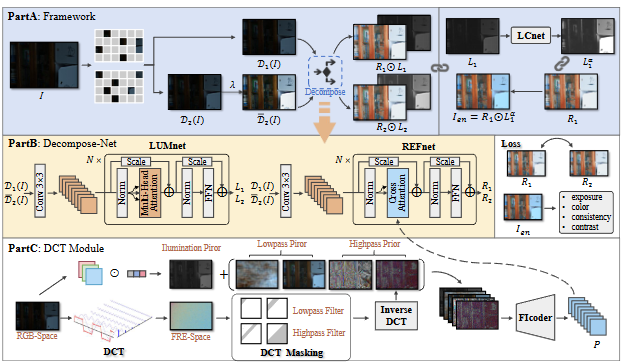
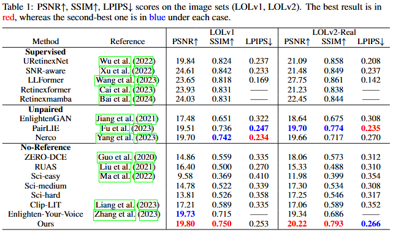
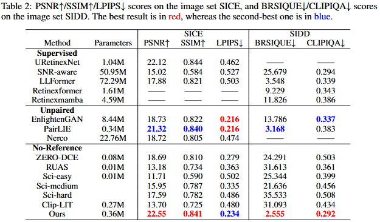

chown -R remote_user_1:remote_user_1 ../checkpoint

# Interpretable Unsupervised Joint Denoising and Enhancement for Real-World low-light Scenarios (ICLR2025)

[Paper](https://arxiv.org/abs/2503.14535) | [Openreview](https://openreview.net/forum?id=PVHoELf5UN&noteId=tWR79MUc4B)

#### News
- **Jan 22, 2025:**  Our work of unsupervised joint denoising and enhancement has been accepted to ICLR 2025!
- **Mar 17, 2025:**  We have released the pretrained model weights and testing code!
- **Mar 31, 2025:**  We have released the training code!

> **Abstract:** *Real-world low-light images often suffer from complex degradations such as local overexposure, low brightness, noise, and uneven illumination. Supervised methods tend to overfit to specific scenarios, while unsupervised methods, though better at generalization, struggle to model these degradations due to the lack of reference images. To address this issue, we propose an interpretable, zero-reference joint denoising and low-light enhancement framework tailored for real-world scenarios. Our method derives a training strategy based on paired sub-images with varying illumination and noise levels, grounded in physical imaging principles and retinex theory. Additionally, we leverage the Discrete Cosine Transform (DCT) to perform frequency domain decomposition in the sRGB space, and introduce an implicit-guided hybrid representation strategy that effectively separates intricate compounded degradations. In the backbone network design, we develop retinal decomposition network guided by implicit degradation representation mechanisms. Extensive experiments demonstrate the superiority of our method.* 
>

  

---

## Installation

     python=3.7
     pytorch=1.11.0
     torchvision==0.12.0 
     torchaudio==0.11.0 
     cudatoolkit=11.3

## Pretrained models

We provide the Google Drive links for the following pre-trained weights.

LOLv1-test: [LOLv1_test.pth](https://drive.google.com/file/d/1UDr8zTLyfcndosGRUPOE6cgoFWAaQmwY/view?usp=drive_link)

LOLv2-test: [LOLv2_test.pth](https://drive.google.com/file/d/1deGacYmmqJ2rlwEJBnWJLWVGGbNYoyNq/view?usp=drive_link)

SICE-test: [SICE_test.pth](https://drive.google.com/file/d/1MG_90yB8HIXIfKLkNlLkQnVZgcMBmiqc/view?usp=drive_link)

You can download the LOLv1 and LOLv2 datasets via the official links. We follow the official train-test data split. For the SICE dataset, we follow the relevant settings from [PairLIE](https://github.com/zhenqifu/PairLIE).

## Testing

You can run the following code for testing：

    python eval.py --data_test path-to-data-folder \
                   --output_folder path-to-save-output

## Evaluation

You can obtain the quantitative metrics of the experiments by running the following command：

    python measure.py

## Training

You can train your own model by running the following commad. For LOLv1 dataset:

    python main.py --save_folder weights/LOLv1/ --logroot logs/your_log/ --data_train your_train_data \
    --data_val your_val_data --referance_val the_high_quality_val_data --lr 1e-5 \
    --light_patch 64 --loss_weights [1, 0.1, 0.1, 0.5]

For LOLv2 dataset:

    python main.py --save_folder weights/LOLv2/ --logroot logs/your_log/ --data_train your_train_data \
    --data_val your_val_data --referance_val the_high_quality_val_data --lr 5e-6 \
    --light_patch 64 --loss_weights [1, 0.1, 0.1, 0.5]

For SICE dataset:

    python main.py --save_folder weights/SICE/ --logroot logs/your_log/ ---data_train your_train_data \
    --data_val your_val_data --referance_val the_high_quality_val_data --lr 1e-5 \
    --light_patch 32 --loss_weights [1, 0.1, 0.1, 0.01]

## Results

  

  

## Citation
If you use our project, please consider citing:

    @article{li2025Interpretable,
      title={Interpretable Unsupervised Joint Denoising and Enhancement for Real-World low-light Scenarios Unsupervised Joint Denoising and Enhancement for Real-World low-light Scenarios},
      author={Huaqiu Li and Xiaowan Hu and Haoqian Wang},
      journal={ICLR},
      year={2025}
    }

Our work is built upon the codebase of [PairLIE](https://github.com/zhenqifu/PairLIE), and we sincerely thank them for their contribution.
